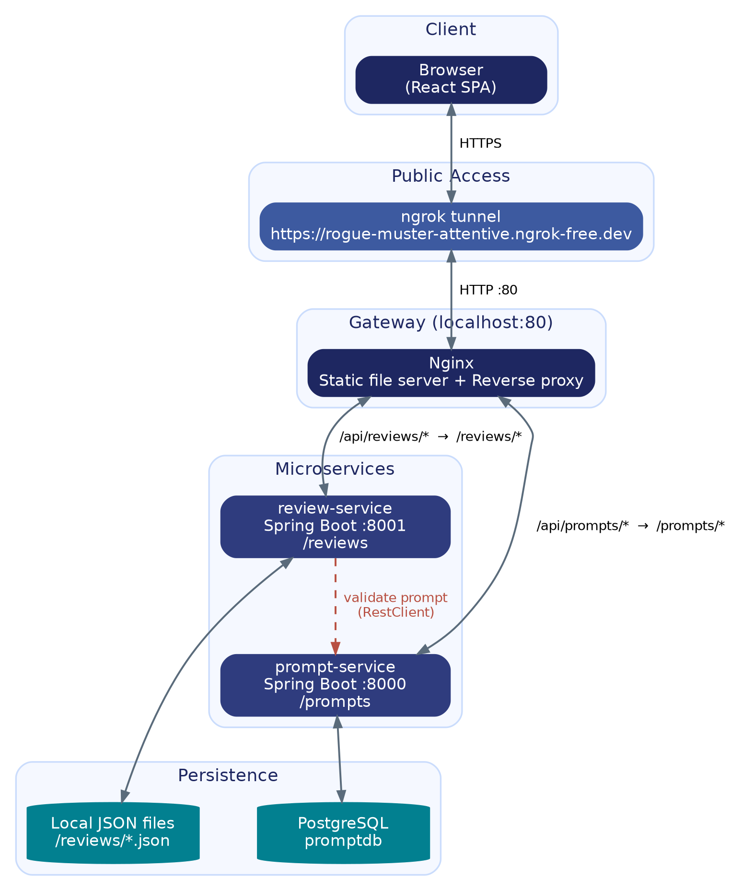

# Prompt Manager

A microservice-based web application for creating, organizing, and reviewing AI prompts. Built as a Software Engineering internship project.

**Live demo:** [rogue-muster-attentive.ngrok-free.dev](https://rogue-muster-attentive.ngrok-free.dev)
**Repository:** [github.com/salehayasir/prompt-manager](https://github.com/salehayasir/prompt-manager)

---

## Overview

Prompt Manager lets users create and catalog reusable AI prompts (name, description, content, tags, target model) and attach reviews/ratings to them. It's built as two independent Spring Boot microservices behind an Nginx gateway, with a React single-page frontend.

## Architecture



- **React SPA** is served as static files by Nginx and talks only to relative `/api/...` paths — no CORS, no hardcoded hosts.
- **Nginx** is the single entry point. It serves the built frontend and reverse-proxies API traffic to whichever backend service owns it, rewriting `/api/prompts/*` → `/prompts/*` and `/api/reviews/*` → `/reviews/*` so each Spring service can keep clean, prefix-free route mappings.
- **prompt-service** (Spring Boot, port `8000`) owns prompt CRUD and persists to **PostgreSQL** via Spring Data JPA.
- **review-service** (Spring Boot, port `8001`) owns reviews, persists each one as a JSON file on disk, and calls back into `prompt-service` over REST (`RestClient`) to validate that a prompt exists before accepting a review for it.
- **ngrok** tunnels the public demo URL to the Nginx gateway running locally, so the whole stack is reachable without deploying to a cloud host.

## Tech Stack

| Layer | Technology |
|---|---|
| Frontend | React 19, Vite, Axios |
| Gateway | Nginx (static hosting + reverse proxy) |
| Backend | Java 17, Spring Boot 4.1 (Web MVC, Data JPA, Validation, Actuator) |
| Database | PostgreSQL (prompt-service) |
| Storage | Local JSON files (review-service) |
| API Docs | springdoc-openapi / Swagger UI |
| Tunneling | ngrok |

## Project Structure

```
prompt-manager/
├── prompt-manager-ui/     # React + Vite frontend
├── prompt-service/        # Spring Boot microservice — prompts (Postgres)
├── review-service/        # Spring Boot microservice — reviews (JSON files)
├── nginx/
│   └── nginx.conf         # Reverse proxy + static file serving
└── docs/assets/           # Architecture diagram
```

## API Reference

### prompt-service (`/prompts`, proxied at `/api/prompts`)

| Method | Path | Description |
|---|---|---|
| `POST` | `/prompts` | Create a prompt |
| `GET` | `/prompts` | List all prompts |
| `GET` | `/prompts/{id}` | Get a single prompt |
| `PUT` | `/prompts/{id}` | Update a prompt |
| `DELETE` | `/prompts/{id}` | Delete a prompt |
| `GET` | `/prompts/{id}/exists` | Check whether a prompt exists |

### review-service (`/reviews`, proxied at `/api/reviews`)

| Method | Path | Description |
|---|---|---|
| `POST` | `/reviews` | Create a review for a prompt |
| `GET` | `/reviews` | List all reviews |
| `GET` | `/reviews/{id}` | Get a single review |
| `GET` | `/reviews/prompt/{promptId}/summary` | Aggregated review summary for a prompt |

## Running Locally

### Prerequisites
- Java 17+ and Maven
- Node.js 18+
- PostgreSQL running locally, with a `promptdb` database
- Nginx

### 1. Start the databases / config
Update `prompt-service/src/main/resources/application.yaml` with your local Postgres credentials if they differ from the defaults.

### 2. Start the backend services
```bash
cd prompt-service
./mvnw spring-boot:run       # runs on :8000

cd ../review-service
./mvnw spring-boot:run       # runs on :8001
```

### 3. Build the frontend
```bash
cd prompt-manager-ui
npm install
npm run build                # outputs to prompt-manager-ui/dist
```

### 4. Point Nginx at the build and start it
Update the `root` path in `nginx/nginx.conf` to point at your local `prompt-manager-ui/dist` folder, then:
```bash
nginx -c /path/to/nginx/nginx.conf
```

Visit `http://localhost`.

### 5. (Optional) Expose it publicly with ngrok
```bash
ngrok http 80
```

## Key Engineering Decisions & Challenges

- **Single origin, no CORS in production.** The frontend never calls the backends directly — everything goes through Nginx on the same origin, so the browser never needs a CORS preflight for normal use.
- **Prefix rewriting instead of prefix stripping.** An early version of `nginx.conf` stripped the entire `/api/prompts/` prefix and forwarded to the backend root, which didn't match either service's actual `@RequestMapping`. The fix rewrites `/api/{service}/...` to `/{service}/...`, preserving the path each Spring controller actually expects, and normalizes trailing slashes so `/api/prompts` and `/api/prompts/` both resolve to the exact same backend route.
- **Polyglot persistence.** prompt-service uses Postgres for structured, queryable prompt data; review-service intentionally uses flat JSON files, since reviews are simpler, append-heavy records that don't need relational guarantees.

## Author

**Saleha Yasir**
Software Engineering Intern
