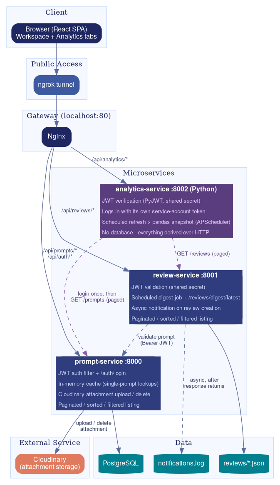

# Prompt Manager

A microservice-based web application for creating, organizing, and reviewing AI prompts. Built as a Software Engineering internship project.

**Live demo:** [rogue-muster-attentive.ngrok-free.dev](https://rogue-muster-attentive.ngrok-free.dev)
**Repository:** [github.com/salehayasir/prompt-manager](https://github.com/salehayasir/prompt-manager)

---

## Overview

Prompt Manager lets users create and catalog reusable AI prompts (name, description, content, tags, target model) and attach reviews/ratings to them. It's built as two independent Spring Boot microservices behind an Nginx gateway, with a React single-page frontend.

## Architecture



- **React SPA** is served as static files by Nginx and talks only to relative `/api/...` paths — no CORS, no hardcoded hosts.
- **Nginx** is the single entry point. It serves the built frontend and reverse-proxies API traffic to whichever backend service owns it, rewriting `/api/prompts/*` → `/prompts/*` and `/api/reviews/*` → `/reviews/*` so each Spring service can keep clean, prefix-free route mappings.
- **prompt-service** (Spring Boot, port `8000`) owns prompt CRUD and persists to **PostgreSQL** via Spring Data JPA. It also issues and validates JWTs (`POST /auth/login`), stores reference-file attachments on **Cloudinary**, keeps single-prompt lookups in an in-memory cache, and returns paginated/sorted/filtered listings.
- **review-service** (Spring Boot, port `8001`) owns reviews, persists each one as a JSON file on disk, and calls back into `prompt-service` over REST (`RestClient`) to validate that a prompt exists before accepting a review for it. It validates the same JWT (shared secret) rather than issuing its own, runs a scheduled digest job that aggregates review stats in memory, and fires an async, non-blocking notification (written to `notifications.log`) whenever a review is created.
- **Cloudinary** is the external file-storage provider for prompt attachments — prompt-service is the only caller; the API key/secret never reach the frontend.
- **ngrok** tunnels the public demo URL to the Nginx gateway running locally, so the whole stack is reachable without deploying to a cloud host.

## Tech Stack

| Layer | Technology |
|---|---|
| Frontend | React 19, Vite, Axios |
| Gateway | Nginx (static hosting + reverse proxy) |
| Backend | Java 17, Spring Boot 4.1 (Web MVC, Data JPA, Validation, Security, Cache, Scheduling, Async, Actuator) |
| Database | PostgreSQL (prompt-service) |
| Storage | Local JSON files + `notifications.log` (review-service), Cloudinary (prompt attachments) |
| Auth | JWT (`jjwt`), shared signing secret across both services |
| Caching | Spring Cache abstraction, in-memory `ConcurrentMapCacheManager` |
| API Docs | springdoc-openapi / Swagger UI |
| Tunneling | ngrok |

## Project Structure

```
prompt-manager/
├── prompt-manager-ui/     # React + Vite frontend
├── prompt-service/        # Spring Boot microservice — prompts (Postgres)
├── review-service/        # Spring Boot microservice — reviews (JSON files)
├── nginx/
│   └── nginx.conf         # Reverse proxy + static file serving
└── docs/                  # Architecture diagram (architecture.dot/.svg/.png)
```

## API Reference

All endpoints below (except `/auth/login`) require a `Authorization: Bearer <token>` header. Get a token first:

```bash
curl -X POST http://localhost:8000/auth/login \
  -H "Content-Type: application/json" \
  -d '{"username":"<AUTH_USERNAME>","password":"<AUTH_PASSWORD>"}'
```
Response: `{"token": "...", "expiresInMs": 3600000}`. Both services validate this token using the same `JWT_SECRET` — `review-service` doesn't issue its own tokens, only checks them.

### prompt-service (`/prompts`, proxied at `/api/prompts`)

| Method | Path | Description |
|---|---|---|
| `POST` | `/auth/login` | Log in with `AUTH_USERNAME`/`AUTH_PASSWORD`, get a JWT |
| `POST` | `/prompts` | Create a prompt |
| `GET` | `/prompts` | Paginated prompt listing. Query params: `page` (default `0`), `size` (default `10`), `sortBy` (any `Prompt` field, default `createdAt`), `direction` (`asc`/`desc`, default `asc`), `tag` (optional, case-insensitive substring filter) |
| `GET` | `/prompts/{id}` | Get a single prompt (served from cache on repeat requests — see below) |
| `PUT` | `/prompts/{id}` | Update a prompt (refreshes the cache entry) |
| `DELETE` | `/prompts/{id}` | Delete a prompt (evicts the cache entry) |
| `GET` | `/prompts/{id}/exists` | Check whether a prompt exists |
| `POST` | `/prompts/{id}/attachment` | Upload a reference file (multipart `file` field) to Cloudinary and attach it to the prompt |
| `DELETE` | `/prompts/{id}/attachment` | Delete the prompt's attachment from Cloudinary and clear it from the prompt |

**Pagination response shape** (both list endpoints return this):
```json
{
  "content": [ /* page of items */ ],
  "totalElements": 13,
  "totalPages": 2,
  "currentPage": 0,
  "pageSize": 10
}
```

**Caching:** `GET /prompts/{id}` is backed by an in-memory Spring cache (`ConcurrentMapCacheManager`, no Redis required). The server logs `CACHE MISS` on the first lookup for a given id and `CACHE HIT` on subsequent ones with no database query in between; `PUT`/`DELETE`/attachment changes refresh or evict that entry so the cache never serves stale data. Example:
```bash
curl http://localhost:8000/prompts/{id} -H "Authorization: Bearer <token>"   # CACHE MISS, hits DB
curl http://localhost:8000/prompts/{id} -H "Authorization: Bearer <token>"   # CACHE HIT, no DB query
```

**Attachment upload example:**
```bash
curl -X POST http://localhost:8000/prompts/{id}/attachment \
  -H "Authorization: Bearer <token>" \
  -F "file=@screenshot.png"
```
Allowed types: PNG/JPEG/GIF/WebP images, PDF, plain text, `.doc`/`.docx`. Returns `400` for a missing/unsupported file, `404` if the prompt doesn't exist, `502` if Cloudinary rejects the request, `503` if Cloudinary can't be reached at all.

### review-service (`/reviews`, proxied at `/api/reviews`)

| Method | Path | Description |
|---|---|---|
| `POST` | `/reviews` | Create a review for a prompt. Returns as soon as the review is saved — a notification is fired asynchronously afterward and does not delay the response |
| `GET` | `/reviews` | Paginated review listing. Query params: `page`, `size`, `sortBy` (any `Review` field), `direction`, plus filters `promptId`, `reviewerName`, `minScore`, `maxScore` (all optional) |
| `GET` | `/reviews/{id}` | Get a single review by id (404 if it doesn't exist) |
| `GET` | `/reviews/prompt/{promptId}` | List all reviews for a specific prompt |
| `GET` | `/reviews/{promptId}/summary` | Aggregated review summary for a prompt |
| `GET` | `/reviews/digest/latest` | Latest scheduled digest: total review count, average score, and the id of the highest (average-scoring) prompt |

Same pagination response shape as prompt-service (`content` + `totalElements`/`totalPages`/`currentPage`/`pageSize`).

**Scheduled digest:** a `@Scheduled` job runs every `DIGEST_INTERVAL_MS` (also once immediately at startup), recomputing stats from all reviews and logging the result. `GET /reviews/digest/latest` returns that same computed snapshot without re-scanning the data on every request:
```json
{"totalReviews": 9, "averageScore": 4.78, "highestScoringPromptId": "832b949f-...", "computedAt": "2026-07-29T04:31:53.445"}
```

**Async notification:** creating a review triggers an `@Async` task (its own dedicated thread pool, not the request thread) that appends a line to `notifications.log` with the reviewer, prompt id, and score. The task deliberately sleeps a few seconds to demonstrate that `POST /reviews` returns immediately regardless:
```bash
time curl -X POST http://localhost:8001/reviews \
  -H "Authorization: Bearer <token>" \
  -H "Content-Type: application/json" \
  -d '{"promptId":"<id>","reviewerName":"Saleha","score":5,"feedback":"..."}'
# returns in well under a second; the log line lands ~3s later
```

#### Error responses

Both services use a centralized `@RestControllerAdvice` exception handler and return a consistent JSON error body:

```json
{
  "timestamp": "2026-07-28T12:00:00",
  "status": 404,
  "error": "Not Found",
  "message": "Prompt not found with id: <uuid>"
}
```

| Status | When |
|---|---|
| `400 Bad Request` | Invalid request body/params, bad UUID, invalid `sortBy` field, missing/unsupported attachment file |
| `401 Unauthorized` | Missing/invalid/expired JWT, or bad login credentials |
| `404 Not Found` | The requested prompt, review, or attachment does not exist |
| `502 Bad Gateway` | Cloudinary was reached but rejected the request |
| `503 Service Unavailable` | Cloudinary or prompt-service could not be reached at all (connection refused, timeout) |
| `500 Internal Server Error` | Any other unexpected failure |

Creating a review looks up the prompt in prompt-service and stores only its text content in `promptSnapshot` (a `String`), not the full prompt object.

## Running Locally

### Prerequisites
- Java 17+ and Maven
- Node.js 18+
- PostgreSQL running locally, with a `promptdb` database
- Nginx

### 1. Configure environment variables
Both services read sensitive/environment-specific config from a `.env` file in their own directory (auto-loaded at startup by a small built-in `DotenvLoader`, so no manual `export` needed). Copy the provided templates and fill in real values:

```bash
cp prompt-service/.env.example prompt-service/.env
cp review-service/.env.example review-service/.env
```

| Variable | Used by | Purpose |
|---|---|---|
| `SERVER_PORT` | Both | Port the service listens on (`8000` / `8001`) |
| `DB_URL` / `DB_USERNAME` / `DB_PASSWORD` | prompt-service | Local PostgreSQL connection |
| `PROMPT_SERVICE_URL` | review-service | Base URL for cross-service calls into prompt-service |
| `JWT_SECRET` | Both | Shared signing key for issuing (prompt-service) and validating (both) tokens — **must be the same value in both `.env` files** |
| `JWT_EXPIRATION_MS` | prompt-service | How long an issued token stays valid |
| `AUTH_USERNAME` / `AUTH_PASSWORD` | prompt-service | Credentials for the single login account |
| `CLOUDINARY_CLOUD_NAME` / `CLOUDINARY_API_KEY` / `CLOUDINARY_API_SECRET` | prompt-service | Cloudinary account identifier and API credentials |
| `DIGEST_INTERVAL_MS` | review-service | How often the scheduled digest job recomputes review stats |

`.env` files are git-ignored — never commit real credentials. Only the `.env.example` templates (placeholder values only) are tracked.

### 2. Start the backend services
```bash
cd prompt-service
./mvnw spring-boot:run       # runs on :8000

cd ../review-service
./mvnw spring-boot:run       # runs on :8001
```

### 3. Build the frontend
```bash
cd prompt-manager-ui
npm install
npm run build                # outputs to prompt-manager-ui/dist
```

### 4. Point Nginx at the build and start it
Update the `root` path in `nginx/nginx.conf` to point at your local `prompt-manager-ui/dist` folder, then:
```bash
nginx -c /path/to/nginx/nginx.conf
```

Visit `http://localhost`.

### 5. (Optional) Expose it publicly with ngrok
```bash
ngrok http 80
```

## Integration Test Walkthrough

A single end-to-end sequence exercising every Week 2 feature — auth, attachments, caching, async notifications, and the digest job. Run each step in order (Git Bash / any bash shell; swap in real values as you go):

```bash
# 1. Log in
TOKEN=$(curl -s -X POST http://localhost:8000/auth/login \
  -H "Content-Type: application/json" \
  -d '{"username":"<AUTH_USERNAME>","password":"<AUTH_PASSWORD>"}' | jq -r .token)

# 2. Create a prompt
PROMPT_ID=$(curl -s -X POST http://localhost:8000/prompts \
  -H "Authorization: Bearer $TOKEN" -H "Content-Type: application/json" \
  -d '{"name":"Demo Prompt","description":"integration test","content":"hello","tags":"demo","modelTarget":"gpt-4"}' \
  | jq -r .id)

# 3. Attach a file
curl -X POST http://localhost:8000/prompts/$PROMPT_ID/attachment \
  -H "Authorization: Bearer $TOKEN" -F "file=@screenshot.png"

# 4. Fetch it twice — the server log shows CACHE MISS then CACHE HIT
curl http://localhost:8000/prompts/$PROMPT_ID -H "Authorization: Bearer $TOKEN"
curl http://localhost:8000/prompts/$PROMPT_ID -H "Authorization: Bearer $TOKEN"

# 5. Submit a review — response returns immediately; notification lands ~3s later
time curl -X POST http://localhost:8001/reviews \
  -H "Authorization: Bearer $TOKEN" -H "Content-Type: application/json" \
  -d "{\"promptId\":\"$PROMPT_ID\",\"reviewerName\":\"Saleha\",\"score\":5,\"feedback\":\"great\"}"
cat review-service/notifications.log   # appears a few seconds after step 5 returns

# 6. Check the digest endpoint — totalReviews/averageScore reflect the new review
#    on its next scheduled run (or immediately, if DIGEST_INTERVAL_MS is low)
curl http://localhost:8001/reviews/digest/latest -H "Authorization: Bearer $TOKEN"
```

What each step demonstrates:
1. **Auth** — a valid token is required for everything past this point.
2. **Prompt creation** — baseline JPA-backed CRUD.
3. **Cloudinary integration** — the file is uploaded and its `attachmentUrl`/`attachmentPublicId` saved on the prompt.
4. **Caching** — the first `GET` logs `CACHE MISS` (hits Postgres); the second logs `CACHE HIT` (no DB query).
5. **Async notification** — `time` shows the HTTP response returning in well under the ~3s the notification task deliberately sleeps for; `notifications.log` gets a new line shortly after.
6. **Scheduled digest** — the background job (running independently on its own interval) has already picked up the new review by the time you check.

(If `jq` isn't available on your system, just copy the `token`/`id` values manually from each response instead of piping through it.)

## Key Engineering Decisions & Challenges

- **Single origin, no CORS in production.** The frontend never calls the backends directly — everything goes through Nginx on the same origin, so the browser never needs a CORS preflight for normal use.
- **Prefix rewriting instead of prefix stripping.** An early version of `nginx.conf` stripped the entire `/api/prompts/` prefix and forwarded to the backend root, which didn't match either service's actual `@RequestMapping`. The fix rewrites `/api/{service}/...` to `/{service}/...`, preserving the path each Spring controller actually expects, and normalizes trailing slashes so `/api/prompts` and `/api/prompts/` both resolve to the exact same backend route.
- **Polyglot persistence.** prompt-service uses Postgres for structured, queryable prompt data; review-service intentionally uses flat JSON files, since reviews are simpler, append-heavy records that don't need relational guarantees.
- **Cache refresh, not just eviction, on writes.** `PUT`/attachment changes use `@CachePut` (not `@CacheEvict`) so the very next `GET` is already a cache hit with the fresh data, rather than forcing one wasted DB round-trip after every update.
- **A dedicated executor for async notifications.** `@Async` without a named executor uses Spring's default `SimpleAsyncTaskExecutor`, which spins up an unbounded new thread per call. A small `ThreadPoolTaskExecutor` bean keeps notification work bounded and separate from other async work the app might add later.
- **Reviews don't have a JPA repository, so pagination/sorting for them is done by hand** over the in-memory list (via reflection, so `sortBy` still accepts any field name) rather than pushed down to a database — a direct consequence of the polyglot-persistence decision above.
- **All Cloudinary/JWT/DB failures are translated at the boundary.** Neither service lets a raw SDK or `IOException` leak to the client — each is caught and re-thrown as a specific exception that `@RestControllerAdvice` maps to a meaningful status code (`502`/`503` for Cloudinary, `401` for auth, etc.), the same pattern used for review-service → prompt-service calls in Week 1.

## Git Branching Strategy

This project follows a lightweight, GitHub-flow-style branching model:

- **`main`** is always the stable, working state of the project. Nothing is committed to it directly.
- All work happens on a short-lived **`feature/<short-description>`** branch (e.g. `feature/review-service`, `fix/evaluator-feedback`), branched off the latest `main`.
- Work is merged back into `main` via a **pull request** (merge commit), not a direct push, so history shows what changed and why as a discrete unit rather than as loose commits on `main`.
- Branches are deleted after merging to keep the branch list clean.

## Author

**Saleha Yasir**
Software Engineering Intern
